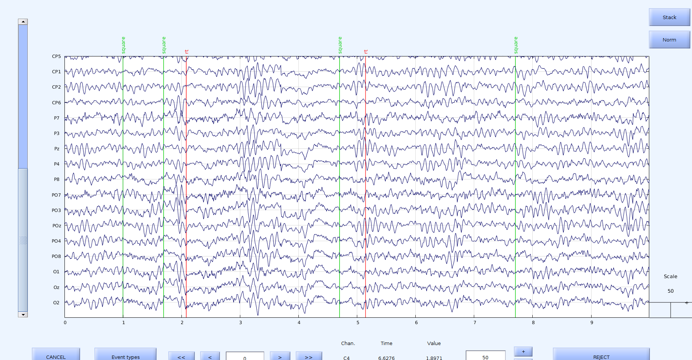
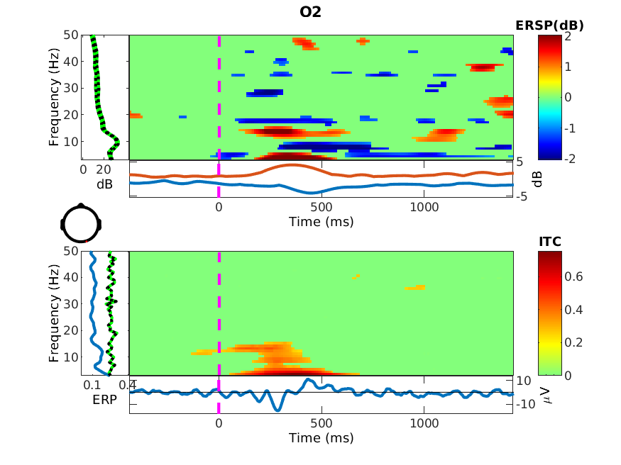

# EEG-Data-Analysis

Includes data analysis codes for EEG data using EEGLAB in Matlab. Codes are created by following the tutorials of SCCN (https://sccn.ucsd.edu/wiki/EEGLAB#The_EEGLAB_Tutorial_Outline).

1. Chapter1-Chapter-4:
  * Chapter1: How to load data to EEGLAB?
  
  * Chapter2: How to determine channel locations?
  
  * Chapter3: Plotting channel spectra and maps

    Example output:
    
  
  * Chapter4: Data preprocessing (high-low pass filters, re-referencing data)
  
2. Chapter5-Chapter8: This folders include the data coming from chapter4 and chapter5.
 * Chapter5: Extracting epochs
 
 * Chapter6: Averaging the data (check .pdf files for example output)
 
 * Chapter7: Selecting data epochs and comparing (check .pdf files for example output)
 
 * Chapter8: Plotting ERP images (check .pdf files for example output)
 
 3. Chapter11: Time/Frequency Decomposition
 
 Example output: 

